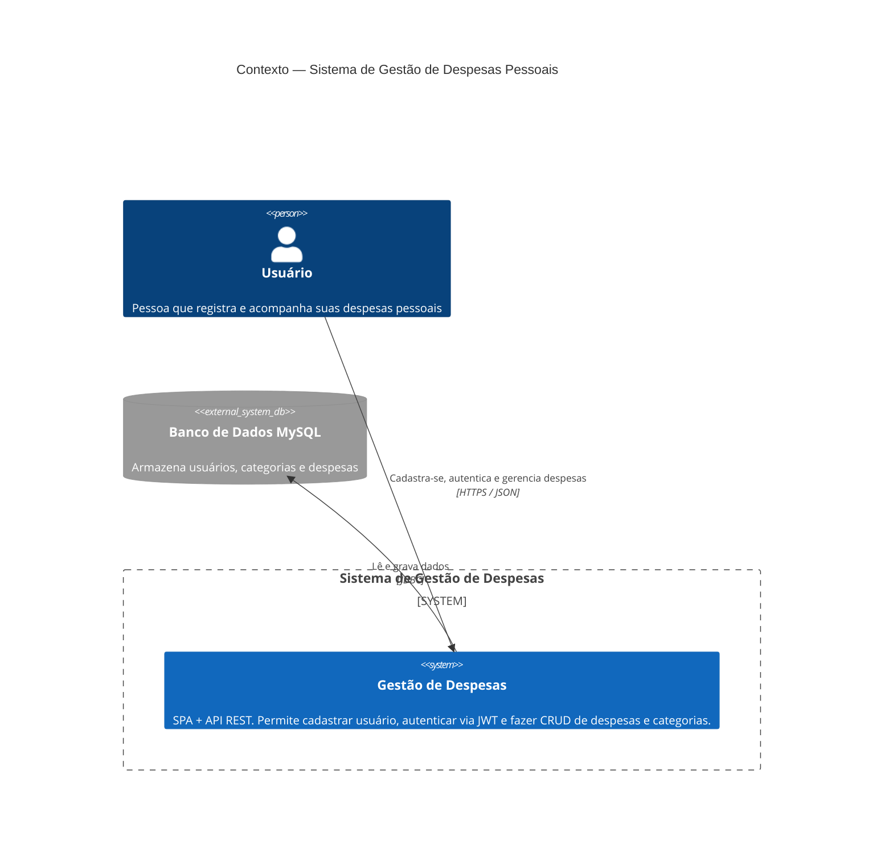

# C4 — Nível 1: Diagrama de Contexto

Mostra o sistema como uma caixa única e quem interage com ele. O sistema é
**autocontido**: não há integrações externas (e-mail, pagamento, OAuth de terceiros) até o momento.

## Atores e sistemas

| Elemento | Tipo | Descrição |
|----------|------|-----------|
| **Usuário** | Pessoa | Único ator humano. Autentica-se e gerencia *suas* despesas. Não há papéis/roles diferenciados (`getAuthorities()` retorna lista vazia). |
| **Gestão de Despesas** | Sistema | O produto (SPA + API). |
| **MySQL** | Sistema externo (infra) | Persistência relacional. Em produção, hospedado junto à API no Railway. |

## Observações

- Não existe administrador, nem distinção de perfis — todo usuário autenticado tem o mesmo nível de acesso.
- O escopo de "minhas despesas" deveria isolar dados por usuário, mas hoje é aplicado de forma incompleta (ver [05-casos-de-uso.md](05-casos-de-uso.md) e [08](08-frameworks-e-decisoes.md#-lacunas-conhecidas)).
