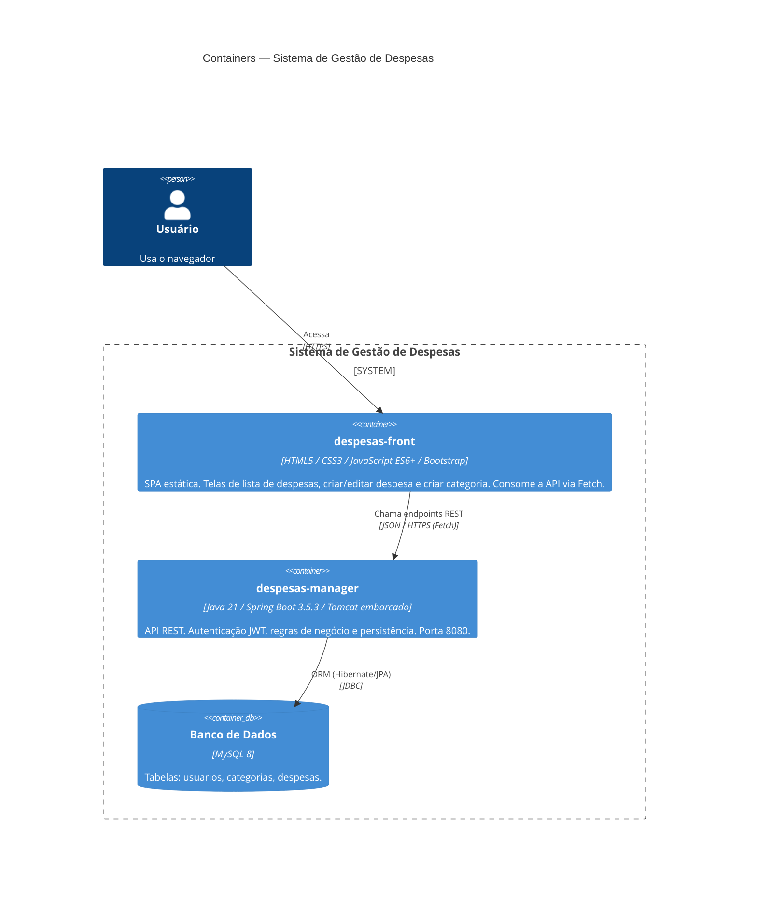
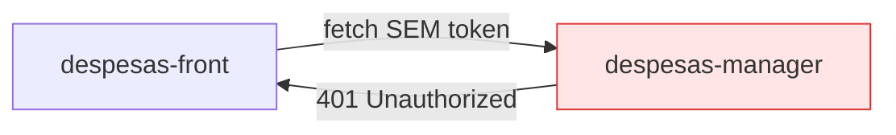

# C4 — Nível 2: Diagrama de Containers

Detalha as unidades executáveis/implantáveis e como se comunicam.

## Containers

| Container | Tecnologia | Responsabilidade |
|-----------|-----------|------------------|
| **despesas-front** | HTML/CSS/JS puro + Bootstrap + Bootstrap Icons | Interface do usuário. Renderiza tabela de despesas, total, filtro por categoria; formulários de despesa/categoria. URL da API fixa no código (`dispesas-manager-production.up.railway.app`). |
| **despesas-manager** | Spring Boot (Spring MVC, Spring Security, Spring Data JPA) | Expõe `/auth`, `/despesas`, `/categorias`. Emite/valida JWT, aplica BCrypt, regras de negócio. |
| **MySQL** | MySQL 8 | Persistência. `ddl-auto=validate` — o schema **não** é criado pela aplicação. |

## Comunicação

| De → Para | Protocolo | Detalhe |
|-----------|-----------|---------|
| Usuário → SPA | HTTPS | Browser carrega arquivos estáticos. |
| SPA → API | HTTPS + JSON | `fetch()`. CORS liberado na API (`@CrossOrigin(origins = "*")`). |
| API → MySQL | JDBC | `mysql-connector-j`, dialeto `MySQL8Dialect`. |

## 🔴 Lacuna de integração

A SPA **não implementa login nem envia o header `Authorization: Bearer`**, mas a API
protege `/despesas` e `/categorias` (`anyRequest().authenticated()`). Resultado: no estado
atual toda chamada do front à API retorna **401**. O front (último commit 02/05) ficou
atrás da introdução do JWT no back-end (09/06).

