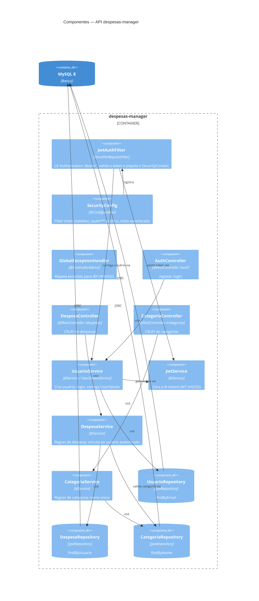
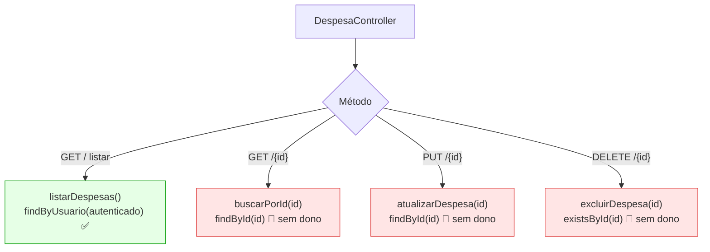

# C4 — Nível 3: Diagrama de Componentes (API)

Detalha o interior do container **despesas-manager** (pacote `com.felipe.despesas`),
organizado em camadas.

## Camadas e componentes

### `config` — Segurança / infraestrutura
| Componente | Papel |
|-----------|-------|
| `SecurityConfig` | Filter chain: CSRF off, sessão STATELESS, `/auth/**` liberado, `anyRequest().authenticated()`, entry point devolve 401. |
| `JwtAuthFilter` | Para cada request, extrai o Bearer token, recupera o e-mail, carrega `UserDetails` e autentica no `SecurityContextHolder`. Exceções são silenciadas → segue sem autenticar (cai em 401). |
| `PasswordConfig` | Expõe o bean `PasswordEncoder` = `BCryptPasswordEncoder`. |

### `controller` — Borda HTTP
| Componente | Base path | Endpoints |
|-----------|-----------|-----------|
| `AuthController` | `/auth` | `POST /register`, `POST /login` (públicos) |
| `DespesaController` | `/despesas` | `GET`, `GET /{id}`, `POST`, `PUT /{id}`, `DELETE /{id}` |
| `CategoriaController` | `/categorias` | `GET`, `POST`, `PUT`, `DELETE /{id}` |

### `services` — Regras de negócio
| Componente | Responsabilidade |
|-----------|------------------|
| `UsuarioService` (`UserDetailsService`) | `criarUsuario`, `login` (verifica BCrypt + emite token), `loadUserByUsername`. ⚠️ `validarUsuario()` está vazio. |
| `JwtService` | `gerarToken` (subject=email, exp 24h, HS256) e `extrairEmail`. |
| `DespesaService` | CRUD + `validarDespesa` (valor>0, data não futura, descrição não vazia). Pega o usuário via `SecurityContextHolder`. 🔴 ownership só checado no `listar`. |
| `CategoriaService` | CRUD + unicidade de `nome`. Categorias são globais (sem vínculo a usuário). |

### `repository` — Acesso a dados (Spring Data JPA)
`UsuarioRepository.findByEmail`, `DespesaRepository.findByUsuario`, `CategoriaRepository.findByNome` — derivados de query, sem JPQL manual.

### `exception`
`GlobalExceptionHandler` (`@ControllerAdvice`) + `InvalidCredentialsException`.

## 🔴 Anotação de segurança no fluxo de despesas

