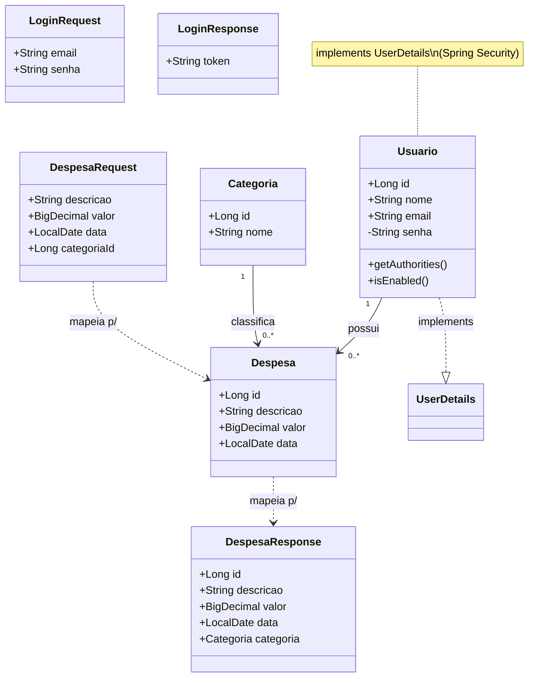
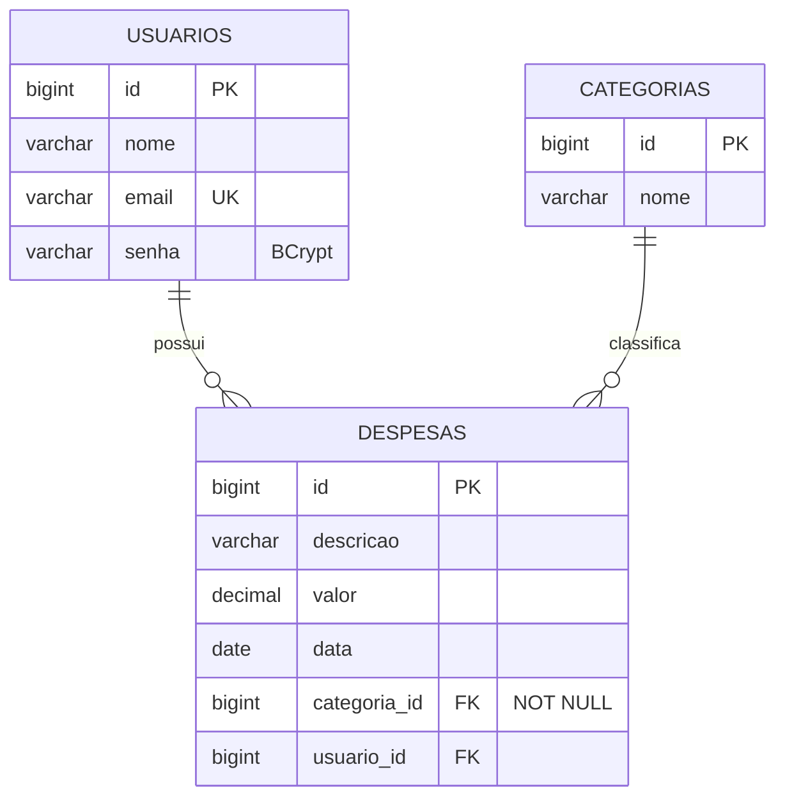

# Modelo de Domínio

## Diagrama de classes (entidades JPA + DTOs)

- `Usuario` **é** um `UserDetails` (acopla domínio e Spring Security — funciona, mas mistura responsabilidades).
- `Despesa` referencia `Categoria` (`@ManyToOne`, `EAGER`, `categoria_id NOT NULL`) e `Usuario` (`@ManyToOne`).
- DTOs isolam a borda HTTP do modelo — exceto `DespesaResponse`, que ainda **expõe a entidade `Categoria`** inteira.

## Modelo entidade-relacionamento (tabelas)

### Observações de modelagem
- `valor` usa `BigDecimal` (mapeado para `DECIMAL`) — correto para dinheiro (corrigido do `Double` no PR #11).
- `CATEGORIAS` não tem `usuario_id` → categorias são **compartilhadas entre todos os usuários**.
- `usuarios.email` é único; `usuarios.nome` existe mas nunca é preenchido no fluxo de registro.
- `despesas.usuario_id` não está marcado `NOT NULL` no código (`@ManyToOne` sem `@JoinColumn(nullable=false)`).
