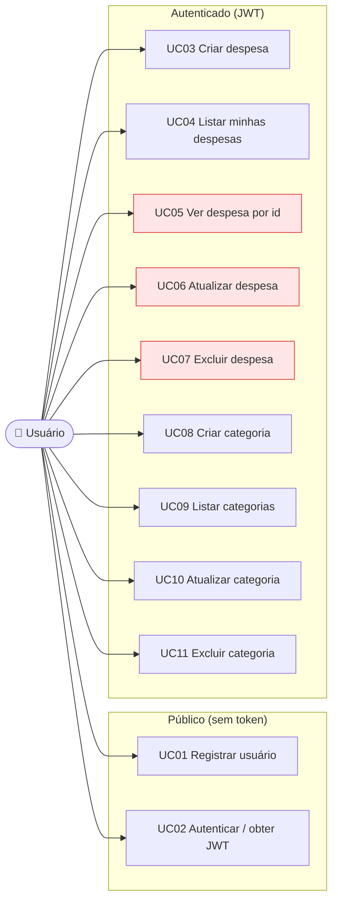

# Casos de Uso

## Mapa de casos de uso

> 🔴 UC05/UC06/UC07 estão em vermelho: hoje operam sobre **qualquer** despesa por id, sem verificar o dono.

## Mapa endpoint × método × autenticação

| UC | Método | Endpoint | Auth | Sucesso | Erros tratados |
|----|--------|----------|------|---------|----------------|
| UC01 | POST | `/auth/register` | ❌ público | 201 | 409 e-mail duplicado |
| UC02 | POST | `/auth/login` | ❌ público | 200 + token | 401 credenciais inválidas |
| UC03 | POST | `/despesas` | ✅ JWT | 201 | 422 validação |
| UC04 | GET | `/despesas` | ✅ JWT | 200 (só do usuário) | — |
| UC05 | GET | `/despesas/{id}` | ✅ JWT | 200 / 404 | 🔴 sem checagem de dono |
| UC06 | PUT | `/despesas/{id}` | ✅ JWT | 200 | 422; 🔴 sem checagem de dono |
| UC07 | DELETE | `/despesas/{id}` | ✅ JWT | 204 | 422 inexistente; 🔴 sem checagem de dono |
| UC08 | POST | `/categorias` | ✅ JWT | 201 | 422 nome duplicado |
| UC09 | GET | `/categorias` | ✅ JWT | 200 | — |
| UC10 | PUT | `/categorias` | ✅ JWT | 200 | 422 inexistente/duplicado |
| UC11 | DELETE | `/categorias/{id}` | ✅ JWT | 204 | 422 inexistente |

## Regras de negócio (UC03/UC06 — Despesa)

`DespesaService.validarDespesa()`:
- `valor` deve ser **> 0**;
- `data` **não** pode ser futura;
- `descricao` não pode ser vazia/em branco.

## Regras de negócio (UC08/UC10 — Categoria)

- `nome` deve ser **único** (validado na criação e na atualização).
