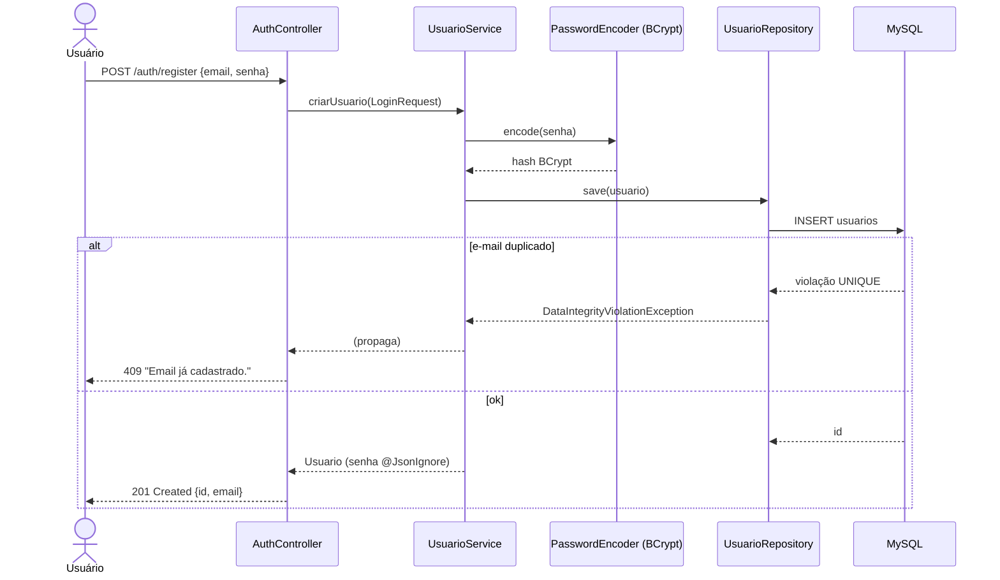
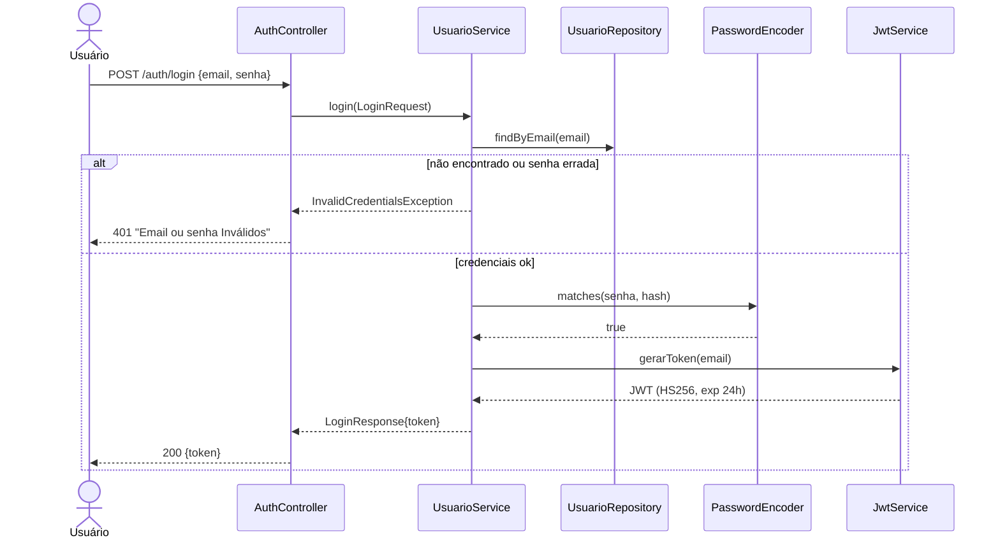
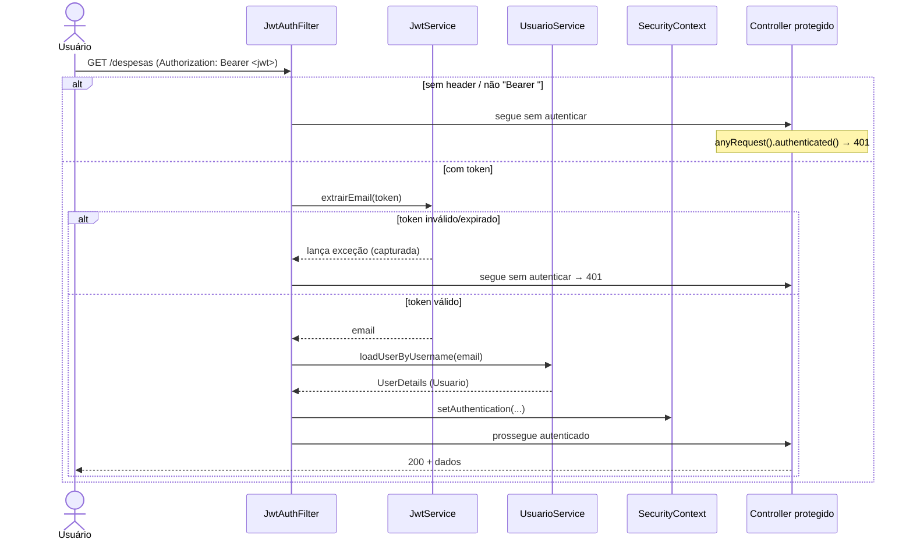
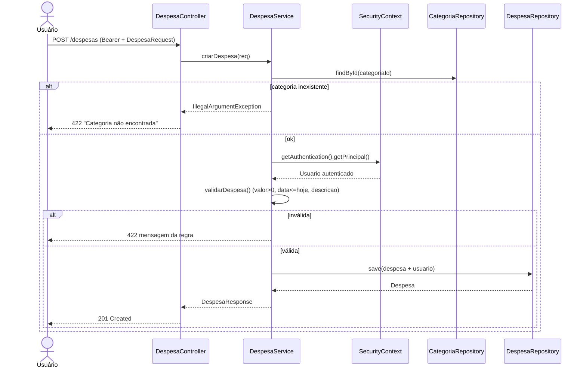

# Fluxos — Diagramas de Sequência

## 1. Registro de usuário (`POST /auth/register`)

## 2. Login e emissão de JWT (`POST /auth/login`)

## 3. Request autenticado — filtro JWT (qualquer rota protegida)

## 4. Criar despesa (`POST /despesas`)

