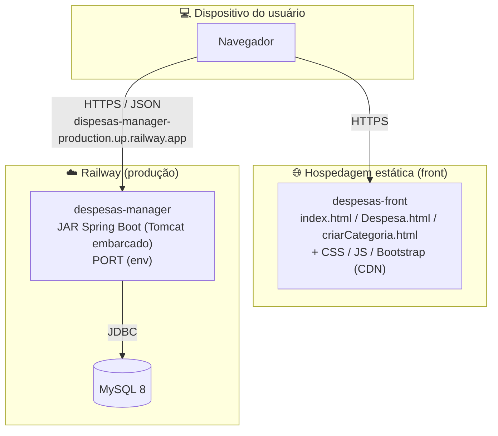

# Topologia de Implantação

## Ambientes e configuração

A API é configurada por variáveis de ambiente (`application.properties`), com defaults para desenvolvimento local:

| Variável | Default (dev) | Uso |
|----------|---------------|-----|
| `PORT` | `8080` | Porta HTTP |
| `DATABASE_URL` | `jdbc:mysql://localhost:3306/mydb` | Conexão JDBC |
| `DATABASE_USERNAME` | `root` | Usuário do banco |
| `DATABASE_PASSWORD` | *(vazio)* | Senha do banco |
| `JWT_SECRET` | `minha-chave-local-de-desenvolvimento` | Chave HS256 (⚠️ precisa ≥ 32 bytes) |

## Notas de implantação

- **Build:** Maven wrapper (`./mvnw`) → JAR executável (`spring-boot-maven-plugin`).
- **Banco:** `spring.jpa.hibernate.ddl-auto=validate` — a aplicação **não cria nem altera** o schema. 🟠 Um banco novo no Railway falha ao subir sem o schema pré-existente; não há Flyway/Liquibase.
- **Front:** a hospedagem exata não está versionada nos repositórios (provável GitHub Pages ou similar). A URL da API está fixa no código JS.
- **DevTools:** `spring-boot-devtools` está no classpath (escopo runtime/optional) — irrelevante em produção.
- **Swagger UI:** `springdoc-openapi` está no `pom.xml` → disponível em `/swagger-ui.html` (apesar de o README listar Swagger como "futuro").
