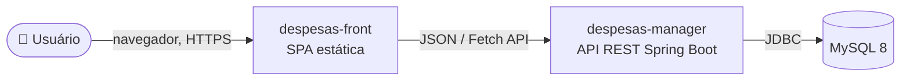

# 📐 Especificação de Arquitetura — API de Gerenciamento de Despesas

Documentação de arquitetura do sistema **despesas-manager** (back-end) e **despesas-front** (front-end),
gerada a partir da leitura do código-fonte (back-end `e3a25b3`, front `da5b52b`).

Os diagramas usam **[Mermaid](https://mermaid.js.org/)** e renderizam direto no GitHub — sem ferramenta externa.

---

## 🗂️ Índice

| # | Documento | Conteúdo |
|---|-----------|----------|
| 1 | [01-contexto-c4.md](01-contexto-c4.md) | **C4 Nível 1 — Contexto.** Quem usa o sistema e fronteiras. |
| 2 | [02-containers-c4.md](02-containers-c4.md) | **C4 Nível 2 — Containers.** SPA, API e banco; protocolos. |
| 3 | [03-componentes-c4.md](03-componentes-c4.md) | **C4 Nível 3 — Componentes.** Camadas internas da API. |
| 4 | [04-modelo-de-dominio.md](04-modelo-de-dominio.md) | Diagrama de classes (JPA) e modelo entidade-relacionamento. |
| 5 | [05-casos-de-uso.md](05-casos-de-uso.md) | Casos de uso, atores e mapa endpoint × método × auth. |
| 6 | [06-fluxos-sequencia.md](06-fluxos-sequencia.md) | Diagramas de sequência: registro, login, request autenticado, CRUD. |
| 7 | [07-deploy.md](07-deploy.md) | Topologia de implantação (Railway, MySQL, navegador). |
| 8 | [08-frameworks-e-decisoes.md](08-frameworks-e-decisoes.md) | Stack completa, decisões arquiteturais e lacunas conhecidas. |

---

## 🎯 Visão geral

Sistema de **controle de despesas pessoais** dividido em dois repositórios:

- **`despesas-manager`** — API REST em **Spring Boot 3.5.3 / Java 21**, autenticação **JWT**, persistência **MySQL 8** via Spring Data JPA. Arquitetura em camadas (`controller → service → repository → model`).
- **`despesas-front`** — SPA estática em **HTML/CSS/JavaScript puro** (Bootstrap + Fetch API), consumindo a API.

---

## ⚠️ Estado atual × estado-alvo

Esta especificação documenta a arquitetura **como ela está hoje**. Pontos onde o
implementado diverge do desejado estão marcados com 🔴/🟠 ao longo dos documentos e
consolidados em [08-frameworks-e-decisoes.md](08-frameworks-e-decisoes.md#-lacunas-conhecidas).
Resumo:

- 🔴 **Controle de acesso parcial (IDOR):** `GET/PUT/DELETE /despesas/{id}` não validam o dono.
- 🔴 **Front sem autenticação:** a SPA não envia `Authorization: Bearer`, então não conversa com a API protegida.
- 🟠 Sem migrations (schema externo), sem Bean Validation no registro, CORS aberto.

---

## 🛠️ Como manter

Os diagramas são código (Mermaid). Ao alterar o sistema, atualize o `.md` correspondente
no mesmo PR. Para pré-visualizar localmente: VS Code + extensão *Markdown Preview Mermaid Support*,
ou cole o bloco em <https://mermaid.live>.
