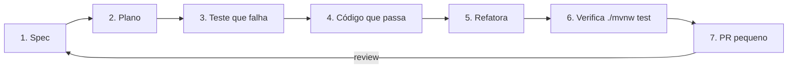

# 🤖 Plano de Adoção de IA + Spec-Driven Development

> **Para quem é este documento:** Felipe (e qualquer pessoa que for evoluir o projeto).
> **Objetivo:** deixar o repositório preparado para você desenvolver **com o Claude Code**
> de forma eficiente e segura, usando **Spec-Driven Development (SDD)**. Ao final, você
> consegue pedir features e correções ao Claude e receber código focado, testado e revisável.

---

## 1. A ideia em uma frase

> **Você descreve *o quê* (a spec); o Claude implementa *o como*, guiado por testes; você revisa.**

Em vez de pedir "adiciona autenticação" e torcer, você escreve uma **spec** curta (problema,
critérios de aceite, plano de teste) e pede ao Claude para implementá-la com **TDD**. O
resultado é previsível, testado e fácil de revisar em PRs pequenos.

---

## 2. O que já foi configurado neste repo

| Item | Onde | Para que serve |
|------|------|----------------|
| **`CLAUDE.md`** | raiz | O Claude lê automaticamente no início de cada sessão. Contém stack, comandos, convenções e as lacunas a não regredir. |
| **Skills** | `.claude/skills/` | "Receitas" que o Claude carrega sob demanda. Já vêm `rodar-api` e `criar-spec`. |
| **Especificação de arquitetura** | `docs/especificacao/` | C4, domínio, casos de uso, sequência. O mapa do sistema. |
| **Specs SDD** | `docs/specs/` | Template + 5 specs prontas para as correções prioritárias. |

---

## 3. Como o Claude "enxerga" o projeto (os 3 níveis de contexto)

1. **`CLAUDE.md`** — instruções *sempre* presentes. Curto e factual. É a memória do projeto.
2. **Skills** (`.claude/skills/<nome>/SKILL.md`) — carregadas *quando relevantes*. Boas para
   procedimentos repetíveis ("como rodar a API", "como criar uma spec", "como fazer deploy").
3. **Arquivos que você aponta** — quando você diz "leia `docs/specs/spec-001.md`", o Claude
   foca naquilo. Apontar o arquivo certo vale mais que explicar de memória.

> 🧠 **Regra de ouro:** contexto bom > prompt esperto. Aponte a spec, o arquivo, o teste.

---

## 4. O ciclo SDD (passo a passo)



1. **Spec** — use a skill `criar-spec` ou copie `docs/specs/TEMPLATE.md`. Defina problema,
   critérios de aceite verificáveis e plano de teste.
2. **Plano** — peça ao Claude: *"liste os passos e os testes antes de codar"*.
3. **Teste que falha (Red)** — o teste descreve o comportamento esperado e falha primeiro.
4. **Código que passa (Green)** — o mínimo para o teste passar.
5. **Refatora** — limpa mantendo o verde.
6. **Verifica** — `./mvnw test`. **Não** aceite "pronto" sem ver o verde.
7. **PR pequeno** — uma spec por PR. Revisão fácil = merge rápido.

---

## 5. Como pedir bem ao Claude (prompts que funcionam)

| Em vez de... | Peça assim |
|--------------|-----------|
| "arruma a segurança" | "Implemente a `spec-001`. Leia a spec inteira, liste os testes que vai escrever e comece pelo primeiro teste que falha." |
| "cria os testes" | "Escreva um teste de integração que prove que um usuário **não** consegue ler a despesa de outro (`GET /despesas/{id}` deve dar 404)." |
| "tá funcionando?" | "Rode `./mvnw test` e me mostre a saída. Se passar, faça um smoke test com a skill `rodar-api`." |
| "adiciona validação" | "Seguindo a `spec-003`, adicione Bean Validation nos DTOs e trate o erro como 400. Atualize a spec se mudar o escopo." |

**Boas práticas de prompt:**

- **Uma tarefa por vez.** Peça a spec-001 inteira, não "corrija tudo".
- **Exija evidência.** "Me mostre a saída do teste" evita o Claude afirmar sucesso sem checar.
- **Aponte arquivos.** "Leia `DespesaService.java` e `spec-001`" > "você lembra do service?".
- **Deixe o teste guiar.** Peça o teste *antes* da implementação.
- **Reaja ao plano.** O Claude propõe um plano; você corrige antes de ele codar.

---

## 6. Roteiro de adoção (fases)

### Fase 0 — Fundação ✅ (este PR)
`CLAUDE.md`, skills iniciais, specs das correções e este guia.

### Fase 1 — Destravar o produto (🔴 crítico)
1. `spec-001` — corrigir o IDOR em `/despesas/{id}` (isolamento por usuário).
2. `spec-002` — autenticação no front (login + envio do JWT).

> Sem essas duas, o app não funciona ponta-a-ponta com segurança.

### Fase 2 — Robustez (🟠)
3. `spec-003` — Bean Validation no registro e nos DTOs.
4. `spec-004` — migrations com Flyway (destrava deploy e testes).
5. `spec-005` — sanear XSS no front.

### Fase 3 — Evolução contínua
- Para cada nova ideia do backlog (refresh token, filtros por período, Docker, gráficos):
  **escreva a spec primeiro**, depois implemente com o Claude via TDD.
- Mantenha `CLAUDE.md` atualizado quando convenções mudarem.

---

## 7. Higiene e segurança ao usar IA

- **Revise sempre o diff.** O Claude erra; o PR pequeno existe para você pegar isso.
- **Nunca comite segredos.** `JWT_SECRET`, senha de banco etc. ficam em env vars.
- **Confie nos testes, não na confiança do modelo.** Verde no `./mvnw test` é a prova.
- **Não deixe o Claude fazer push/PR sem você pedir.** Ele deve parar e te mostrar antes.
- **`CLAUDE.md` é fonte de verdade do processo** — se ele e o modelo discordarem, o arquivo vence.

---

## 8. Próximo passo prático

```text
1. Instale o Claude Code e abra-o na pasta do projeto.
2. Peça: "Leia o CLAUDE.md e a spec-001. Liste o plano e os testes antes de codar."
3. Siga o ciclo SDD. Faça um PR por spec, na ordem das fases acima.
```

Bom proveito 🚀
